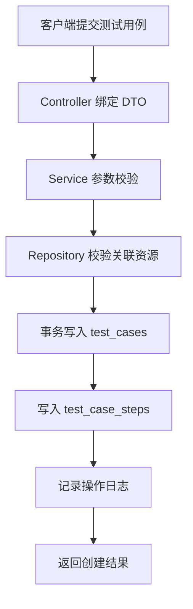
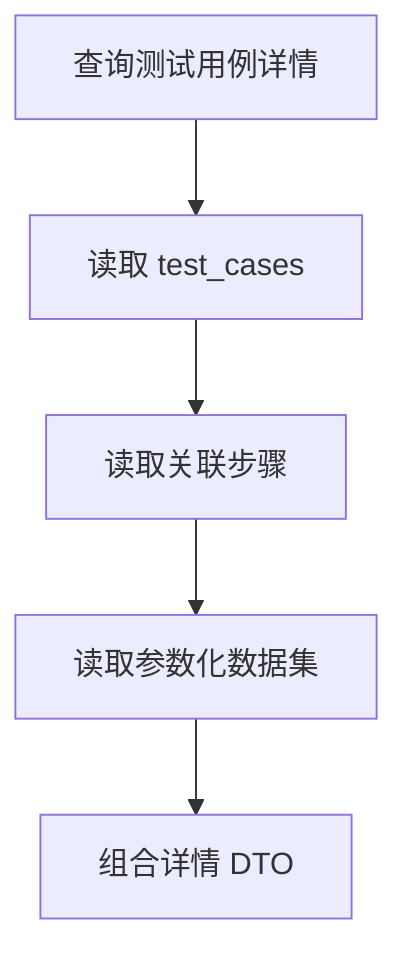
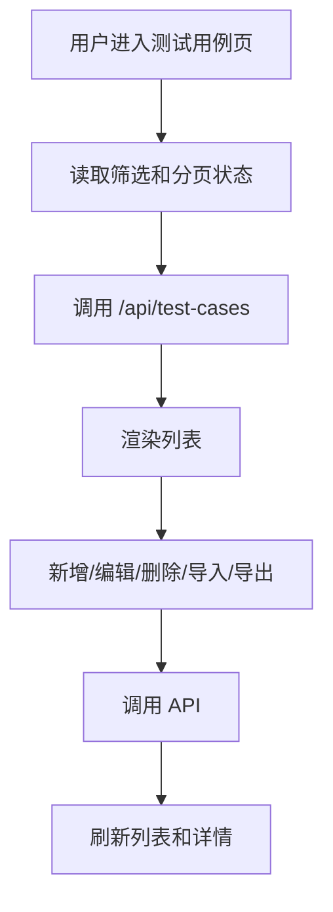

# 测试用例模块 SPEC

## 背景

当前测试用例通过通用 `ui_assets` 表和 `/api/ui/cases` 路由实现，只能覆盖名称、分类、方法、定位、动作等通用字段，无法表达测试用例专属能力，例如用例类型、优先级、参数化数据、步骤关联、权限边界和执行准备状态。

## 目标

在项目根目录内完整实现界面自动化下的测试用例模块：

- 独立数据模型。
- 独立 REST API。
- 支持分页查询、详情、创建、编辑、删除。
- 支持参数化数据集管理。
- 支持用例与页面步骤关联。
- 支持状态、优先级、标签、负责人、权限字段。
- 支持导入导出能力。
- 前端提供列表页、表单页、详情页、参数化配置和导入导出入口。
- 提供后端单元测试、HTTP 集成测试、前端组件测试和关键 E2E 验证。

## 非目标

- 不实现真实执行调度。
- 不实现 AI 生成用例。
- 不删除现有 `/api/ui/cases` 兼容路由。

## 目录设计

按当前 Go 项目分层落地：

```text
backend/internal/model/test_case.go
backend/internal/repository/test_case_repository.go
backend/internal/service/test_case_service.go
backend/internal/controller/test_case_controller.go
backend/internal/router/router.go
backend/cmd/api/bootstrap.go
backend/internal/testutil/
backend/internal/.../*_test.go
docs/api-test-case.md
CHANGELOG.md
SUMMARY.md
frontend/src/pages/UIAutomationPage.js
frontend/src/services/uiAutomationService.js
frontend/src/styles/global.css
```

## 数据库 Schema

```sql
create table if not exists test_cases (
  id bigserial primary key,
  product_id bigint not null references products(id),
  module_id bigint references product_modules(id),
  page_id bigint references ui_assets(id),
  name text not null,
  case_type text not null default 'ui',
  priority text not null default 'P2',
  status text not null default 'draft',
  owner text not null default '',
  tags text not null default '',
  description text not null default '',
  preconditions text not null default '',
  expected_result text not null default '',
  data_enabled boolean not null default false,
  created_by text not null default '',
  updated_at timestamptz not null default now(),
  deleted_at timestamptz,
  created_at timestamptz not null default now(),
  unique(product_id, name)
);

create table if not exists test_case_steps (
  id bigserial primary key,
  case_id bigint not null references test_cases(id),
  step_id bigint not null references ui_assets(id),
  sort_order int not null default 1,
  note text not null default '',
  created_at timestamptz not null default now(),
  unique(case_id, step_id)
);

create table if not exists test_case_datasets (
  id bigserial primary key,
  case_id bigint not null references test_cases(id),
  name text not null,
  variables jsonb not null default '{}'::jsonb,
  enabled boolean not null default true,
  created_at timestamptz not null default now(),
  updated_at timestamptz not null default now(),
  unique(case_id, name)
);
```

## API 设计

所有接口位于 `/api/test-cases`，沿用现有认证中间件。

| 方法 | 路径 | 说明 |
| --- | --- | --- |
| GET | `/api/test-cases` | 分页查询 |
| GET | `/api/test-cases/:id` | 查询详情 |
| POST | `/api/test-cases` | 创建用例 |
| PATCH | `/api/test-cases/:id` | 更新用例 |
| DELETE | `/api/test-cases/:id` | 软删除用例 |
| GET | `/api/test-cases/:id/datasets` | 查询参数化数据 |
| POST | `/api/test-cases/:id/datasets` | 新增参数化数据 |
| PATCH | `/api/test-cases/:id/datasets/:datasetId` | 更新参数化数据 |
| DELETE | `/api/test-cases/:id/datasets/:datasetId` | 删除参数化数据 |
| POST | `/api/test-cases/import` | 导入测试用例 |
| GET | `/api/test-cases/export` | 导出测试用例 |

## 请求 DTO

```json
{
  "productId": 1,
  "moduleId": 2,
  "pageId": 3,
  "name": "登录成功",
  "caseType": "ui",
  "priority": "P1",
  "status": "active",
  "owner": "admin",
  "tags": "smoke,login",
  "description": "验证用户登录成功",
  "preconditions": "存在有效账号",
  "expectedResult": "进入首页",
  "dataEnabled": true,
  "stepIds": [10, 11]
}
```

## 关键流程





## 前端页面设计

测试用例页面挂载在界面自动化下的“测试用例”二级菜单。

- 列表区：ID、项目/产品、模块、所属页面、用例名称、优先级、状态、负责人、更新时间、操作。
- 筛选区：ID、用例名称、项目/产品、模块、所属页面、优先级、状态。
- 操作区：新增、批量删除、导入、导出。
- 表单弹窗：项目/产品、模块、所属页面、用例名称、类型、优先级、状态、负责人、标签、前置条件、预期结果、关联步骤。
- 详情抽屉/区域：展示基础信息、关联步骤、参数化数据集。

## 前端组件结构

```text
UIAutomationPage
└── TestCasesPage
    ├── TestCaseFilters
    ├── TestCaseTable
    ├── TestCaseModal
    ├── TestCaseDetailPanel
    └── DatasetEditor
```

## 前端状态流



## 校验规则

- `productId` 必填且必须存在。
- `name` 必填，长度 1 到 120。
- `caseType` 允许：`ui`、`api`、`unit`、`mixed`。
- `priority` 允许：`P0`、`P1`、`P2`、`P3`。
- `status` 允许：`draft`、`active`、`disabled`。
- `stepIds` 中的步骤必须是 `asset_type = 'page_step'` 且未删除。
- 参数化变量必须是 JSON object。

## 测试计划

- Service 单元测试：
  - 创建成功。
  - 必填字段缺失。
  - 枚举值非法。
  - 关联步骤不存在。
  - 更新不存在数据。
  - 删除不存在数据。
- Repository 集成测试：
  - CRUD。
  - 分页和筛选。
  - 软删除。
  - 步骤关联事务。
  - 参数化数据集 CRUD。
- HTTP 集成测试：
  - 未登录返回 401。
  - 已登录 CRUD 全链路。
  - 参数化接口全链路。
- 前端测试：
  - 列表渲染。
  - 表单校验。
  - API 调用参数。
  - 批量删除、导入导出入口。
- E2E 验证：
  - 登录后进入测试用例页。
  - 查询、新增、编辑、详情查看、删除关键路径。

## 覆盖率目标

前后端 test-case 相关代码覆盖率不低于 85%。

## Lint 和文档

- `gofmt` 必须无 diff。
- `go vet ./...` 必须通过。
- API 文档输出到 `docs/api-test-case.md`。
- 变更摘要输出到 `SUMMARY.md`。
- 变更日志输出到 `CHANGELOG.md`。
