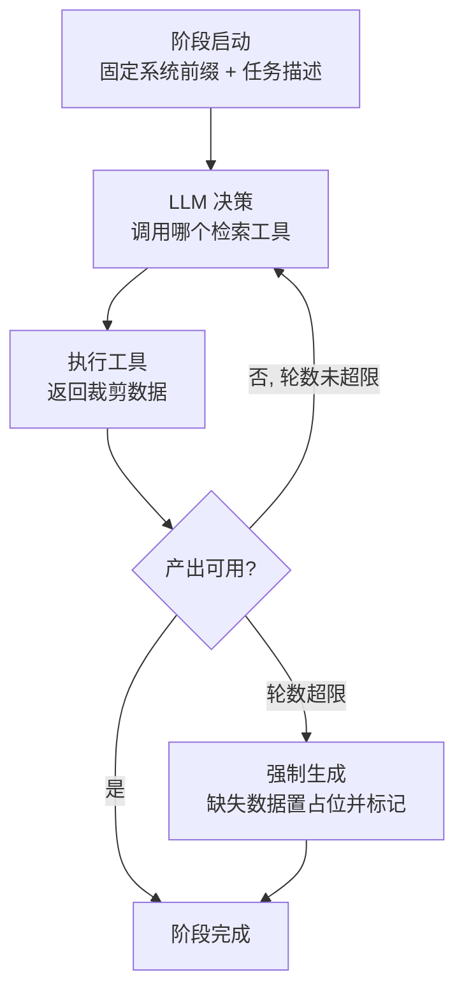

# AI Token 节省设计

| 项目 | 内容 |
| --- | --- |
| 文档版本 | V1.0 |
| 文档日期 | 2026-08-05 |
| 文档状态 | 方案设计 |
| 关联文档 | [AI 自然语言全流程自动化设计方案](AI全流程自动化设计方案.md) |

## 1. 背景与目标

AI 全流程自动化管道包含需求解析、用例生成、资产补建、失败诊断、修复重跑、报告生成等阶段，每个阶段都可能多次调用大模型，是平台未来最主要的 token 消耗来源。

本设计在不降低产出质量的前提下，以**架构层手段**最大化节省 token：

- 核心策略：**工具式按需上下文**——不把项目全量数据一次性塞入提示词，而是让 LLM 通过检索工具按需获取，每步只携带最少的必要片段。
- 落地形态：**纯 Agent 循环**——每个生成阶段先由 LLM 自主决定检索哪些数据，再基于检索结果生成。
- 补充手段：**模型侧前缀缓存（prompt caching）**——稳定提示词前缀复用，享受缓存折扣。

## 2. 总体策略

```text
传统方式：
  [项目全量上下文(接口/元素/变量/历史…) + 需求] → LLM → 产出   （上下文大、重复组装、多阶段重复消耗）

本设计：
  阶段启动 → Agent 循环：
    LLM 决策 → 调检索工具 → 返回裁剪数据 → 基于该数据生成
  （提示词只含：固定系统前缀 + 需求/任务描述 + 已检索的裁剪片段）
```

核心收益：

- 上下文按需增长，避免"每次调用都携带全量项目数据"的重复消耗。
- 检索结果裁剪，控制单次工具返回的 token 量。
- 循环轮数受限，防止失控的多轮消耗。
- 稳定前缀命中缓存折扣，固定开销摊薄。

## 3. 纯 Agent 循环设计

### 3.1 循环流程



每个阶段（parse / generate / diagnose / fix / report）运行一个受限 Agent 循环：

1. 系统前缀（含工具清单与输出规范）注入一次。
2. LLM 决定调用哪个检索工具（如 `get_interface`、`list_page_elements`、`get_execution_failure`、`get_global_variables`）。
3. 工具按裁剪规则返回数据。
4. LLM 基于已检索片段生成目标产出。
5. 产出校验通过即结束；否则回到第 2 步，直到轮数上限。

### 3.2 各阶段可用检索工具

| 阶段 | 建议检索工具 | 用途 |
| --- | --- | --- |
| parse | list_projects / list_products / list_modules / list_test_objects | 确认目标上下文与需求字段 |
| generate(接口) | get_interface / list_interfaces / get_global_variables / get_test_object | 取接口配置、变量、目标地址 |
| generate(界面) | get_page_element / list_page_steps / get_global_variables | 取页面元素、步骤风格参考 |
| diagnose | get_execution_run / get_task_logs / get_debug_events | 取失败结果与关键日志 |
| fix | get_interface / get_test_case + diagnose 结果 | 按诊断修正用例草稿 |
| report | 各阶段产物摘要（非工具） | 汇总 |

> 工具与 AI 助手现有 Tool Calling 工具集共用，在管道场景下仅开放"只读检索"类工具，避免 LLM 在循环中意外写数据。

### 3.3 轮数控制

- 每个 Agent 循环设**轮数上限（默认 5，可配置）**；达到上限后强制进入生成，未检索到的数据置为"占位"，并在阶段产出与最终报告中标记"上下文缺失"。
- 检索结果足以生成时，LLM 应尽早停止检索（提示词中声明"仅检索必要数据，避免多余调用"）。

## 4. 工具结果裁剪规则

所有检索工具在返回前统一裁剪，裁剪在服务端完成（不进入提示词）：

| 裁剪维度 | 规则 |
| --- | --- |
| 字段白名单 | 每个工具定义只返回生成所需必要字段（如接口只返回 id/name/method/path/状态，不含 configuration 全文） |
| 条数上限 | 列表类工具默认返回前 N 条（默认 20，可按需分页）；带排序优先返回最近/最相关 |
| 长字段截断 | description、body、expected_result 等超长字段截断到阈值（默认 200 字符），超长部分以省略号标记 |
| 结构化摘要 | 请求体/断言等结构化字段只返回字段名与类型摘要，不返回完整内容 |
| 敏感脱敏 | Authorization、密钥等一律脱敏，不进提示词 |

实现建议：封装统一的"检索裁剪层"（RetrievalSanitizer），工具实现与其解耦；裁剪参数（条数、截断阈值、白名单）可配置。

## 5. 前缀缓存设计

模型侧 prompt caching（OpenAI / DeepSeek 等 OpenAI 兼容服务普遍支持，命中部分按折扣计费）：

- 构造**稳定前缀**：固定系统提示词 + 任务级规范 + 项目上下文快照（精简元数据，见下）。
- 前缀在循环内与循环间保持不变，仅追加变化的检索片段，最大化前缀复用。
- **项目上下文快照**：按项目 + 版本缓存（`context_snapshot_<projectId>_<version>`）；项目资产变更时递增版本号使缓存失效重建。快照仅含精简元数据（项目/产品/模块清单），不承载大段详情（详情走按需检索）。

约定：

- 提示词组织顺序固定为：系统前缀 → 工具清单 → 项目快照 → 任务描述 → 检索片段，避免前缀漂移。
- 不把时间戳、随机文本放入前缀之前，防止缓存失效。

## 6. 各阶段 Token 预算（估算）

| 阶段 | 输入构成 | 相对量级 |
| --- | --- | --- |
| parse | 系统前缀 + 项目快照 + 需求 | 中 |
| generate | 系统前缀 + 需求 + 1–3 次检索片段 | 大（产出多步骤，但输入受裁剪约束） |
| build | 系统前缀 + 生成结果 + 1 次检索 | 中 |
| diagnose | 系统前缀 + 失败结果摘要 + 关键日志（已摘要） | 中 |
| fix | 系统前缀 + 诊断结论 + 前次生成结果 | 中 |
| report | 系统前缀 + 各阶段摘要 | 小 |

估算基准：相比"全量上下文一次性注入"，单任务总输入 token 预计下降 40%–70%（取决于项目规模；项目资产越多收益越明显）。

## 7. 度量化

在 `ai_model_calls` 表（见全流程方案）基础上按阶段记录并聚合：

- 指标：每阶段 input/output tokens、工具调用次数、循环轮数、缓存命中情况、单任务总 token 与估算成本。
- 前端：AI 测试任务详情页展示"Token 消耗"面板（分阶段柱状图 + 单任务汇总）。
- 验收：优化前后对比单任务平均 token 消耗，作为后续迭代依据。

## 8. 未采纳项与演进

本次未采纳（后续可按需引入）：

- 结果缓存：相同需求/接口生成结果缓存复用（适合重复性高的场景，待实际命中率数据支撑）。
- 输出长度控制：max_tokens 硬上限与结构化输出裁剪（当前以校验驱动的最小字段为准）。
- 分阶段模型路由：简单阶段用更小模型（适合成本敏感部署，待模型成本策略明确）。
- 日志先摘要再入上下文：当前由裁剪层截断承担，重度失败分析时可升级为独立摘要任务。

## 9. 相关文档

- [AI 自然语言全流程自动化设计方案](AI全流程自动化设计方案.md)（管道架构、数据模型、实施分期）
- [AI 智能模块文档](modules/21-AI智能.md)（模型配置与调用现状）
- 后端架构规划：`docs/technical/backend-architecture.md`（AI 安全与审计）
