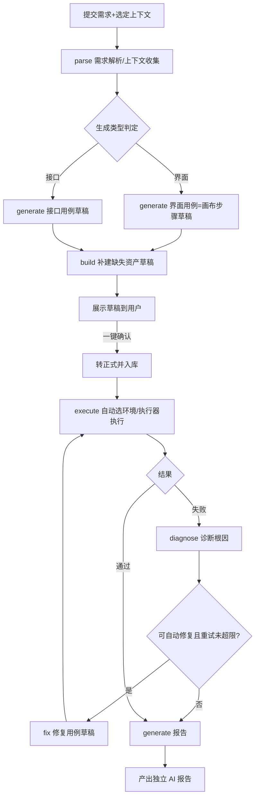

# AI 自然语言全流程自动化设计方案

| 项目 | 内容 |
| --- | --- |
| 文档版本 | V1.0 |
| 文档日期 | 2026-08-05 |
| 文档状态 | 方案设计 |
| 目标读者 | 产品、研发、测试负责人 |

## 1. 背景与目标

### 1.1 现状

Synapse QA 目前已完成传统自动化执行闭环：

- 资产侧：页面元素、页面步骤（画布）、测试用例（含参数化）、接口定义、接口用例、全局变量、项目/产品/模块/测试对象。
- 执行侧：执行批次/任务调度、执行器（API/API Case/UI Playwright/Pytest）、实时日志、测试报告统计。
- AI 侧：AI 助手 Copilot（SSE 流式对话）、Tool Calling（28 个系统工具，可自然语言操作系统功能）、按用户隔离的模型配置。

传统模式下，用例编排、执行、结果分析均需人工驱动，AI 能力仅作为点状辅助。

### 1.2 目标

面向"后期演进"，建设 **AI 自然语言全流程自动化**：用户以一句话提交测试需求，AI 自主完成"需求理解 → 用例生成 → 资产补建 → 环境与执行器选择 → 执行 → 失败诊断 → 自动修复重跑 → 报告生成"的全链路闭环，尽量少人工介入。

### 1.3 设计原则

- **AI 全自主驱动**：除关键落库确认外，流程由 AI 编排自动推进。
- **草稿先行的安全边界**：AI 产出的用例与资产一律先进草稿区，用户一键确认后转正式并自动执行；删除/覆盖等高危动作默认不自动执行。
- **可审计可追溯**：每次 AI 调用的输入摘要、模型、提示词版本、工具执行、产出对象、确认人全部落库。
- **复用现有能力**：执行调度、执行器、用例模型、报告统计全部复用，AI 只做编排与生成，不重造执行链路。
- **渐进落地**：按基建、核心能力、闭环体验三阶段推进，每阶段可独立验收。

## 2. 总体架构

```text
前端 AI 测试任务页
  │  提交需求 + 选定上下文
  ▼
Go 后端
  ├─ AI 任务编排服务（AiOrchestrator）
  │    需求解析 → 用例生成 → 资产补建 → 执行 → 诊断 → 修复重跑 → 报告
  ├─ 任务队列 Redis + Asynq
  │    分阶段任务：parse / generate / build / execute / diagnose / fix / report
  ├─ AI 能力层
  │    上下文组装（项目/产品/接口/元素/历史执行）→ 模型调用 → 结构化解析 → 规则校验
  ├─ 草稿与确认（ai_generated_cases / ai_tasks）
  └─ 复用：执行调度 ExecutionService / 接口用例测试运行 / 报告统计

执行器（现有，不改造）← 接收 execution / api_test_run 任务
```

要点：

- 任务由 `AiOrchestrator` 编排，每个阶段一个 Asynq 任务，阶段间通过任务状态与负载传递上下文。
- 长流程任务异步执行，前端通过任务 ID 轮询/订阅进度（SSE 可复用现有通知/调试流模式）。
- 执行环节直接复用现有 `execution_runs` / `api_test_run_batches` 链路，AI 只负责生成 payload 与发起。

## 3. 全链路流程与状态机



### 3.1 AI 任务状态机

```text
pending(已提交) → parsing(需求解析) → generating(用例生成)
  → awaiting_confirm(等待一键确认) → confirming(确认中)
  → executing(执行) → diagnosing(诊断) → fixing(修复)
  → done(完成) | failed(失败) | canceled(取消)
```

- `awaiting_confirm` 为唯一人工介入点：草稿就绪后任务暂停等待用户确认，超时（可配置，默认 24h）后自动放弃并标记。
- 失败重试次数上限 `maxFixRounds`（默认 2），超限停止修复并在报告中说明。

### 3.2 上下文组装

AI 生成前自动收集并裁剪以下上下文：

- 用户选定或自动发现的：项目、产品、模块、测试环境（target 地址）。
- 接口用例：目标产品下的接口定义（path/method/configuration）、接口全局变量。
- 界面用例：目标产品下的页面元素、已有页面步骤（供风格参考与避免重复）。
- 历史执行：最近同类用例的执行结果与失败记录（作为修复依据）。

上下文遵循：仅读取用户有权限的项目数据；日志先摘要、裁剪、脱敏；敏感字段（Authorization/密钥）不进入模型；对提示词长度做硬限制。

## 4. 数据模型

在现有 `platform_settings`（ai.config.<userId>）基础上新增任务与草稿模型（对齐 `docs/technical/backend-architecture.md` 中 AI 数据模型初稿）：

```sql
-- AI 测试任务（一次全流程的根记录）
create table if not exists ai_tasks (
  id bigserial primary key,
  user_id bigint not null references users(id),
  project_id bigint references projects(id),
  product_id bigint references products(id),
  module_id bigint references product_modules(id),
  env_name text not null default '',
  requirement text not null,                -- 自然语言需求
  task_type text not null default 'auto',   -- auto 全流程 / generate_only / diagnose_only
  status text not null default 'pending',
  model_provider text not null default '',
  model_name text not null default '',
  prompt_version text not null default '',
  input_summary text not null default '',
  output_summary text not null default '',
  fix_rounds int not null default 0,
  max_fix_rounds int not null default 2,
  result jsonb not null default '{}'::jsonb,
  error_message text not null default '',
  confirmed_by text not null default '',
  confirmed_at timestamptz,
  created_at timestamptz not null default now(),
  updated_at timestamptz not null default now()
);

-- AI 生成的用例草稿（界面/接口统一）
create table if not exists ai_generated_cases (
  id bigserial primary key,
  ai_task_id bigint not null references ai_tasks(id),
  project_id bigint not null,
  product_id bigint not null,
  case_type text not null,                  -- ui / api
  title text not null,
  priority text not null default 'P2',
  tags text not null default '',
  preconditions text not null default '',
  steps_json jsonb not null default '{}'::jsonb,   -- 画布流程或接口步骤
  expected_results text not null default '',
  status text not null default 'draft',      -- draft / confirmed / imported / rejected
  confirmed_by text not null default '',
  confirmed_at timestamptz,
  target_case_id bigint,                    -- 转正式后的用例 ID
  created_at timestamptz not null default now()
);

-- AI 生成的资产补建草稿（页面元素/接口等）
create table if not exists ai_generated_assets (
  id bigserial primary key,
  ai_task_id bigint not null references ai_tasks(id),
  asset_type text not null,                 -- page_step / page_element / interface
  name text not null,
  content jsonb not null default '{}'::jsonb,
  status text not null default 'draft',
  target_asset_id bigint,
  created_at timestamptz not null default now()
);

-- 失败诊断
create table if not exists ai_report_diagnoses (
  id bigserial primary key,
  ai_task_id bigint not null references ai_tasks(id),
  execution_run_id bigint references execution_runs(id),
  conclusion text not null default '',
  root_cause_type text not null default '',
  evidence_json jsonb not null default '{}'::jsonb,
  suggestion_json jsonb not null default '{}'::jsonb,
  confidence int not null default 0,
  fix_action text not null default '',      -- auto_fix / suggest / none
  created_at timestamptz not null default now()
);

-- 提示词版本
create table if not exists ai_prompt_versions (
  id bigserial primary key,
  name text not null,
  version text not null,
  template text not null,
  enabled boolean not null default true,
  created_at timestamptz not null default now()
);

-- 模型调用审计
create table if not exists ai_model_calls (
  id bigserial primary key,
  ai_task_id bigint references ai_tasks(id),
  user_id bigint not null,
  stage text not null default '',
  model_provider text not null default '',
  model_name text not null default '',
  prompt_version text not null default '',
  input_tokens int not null default 0,
  output_tokens int not null default 0,
  input_summary text not null default '',
  output_summary text not null default '',
  error text not null default '',
  created_at timestamptz not null default now()
);
```

- 最终报告可复用 `ai_report_diagnoses` + `ai_tasks.result`，也可输出独立 JSON 快照供前端渲染。

## 5. 任务编排（Redis + Asynq）

新增 Go worker（`backend/cmd/worker`）消费 Asynq 队列。任务类型与处理函数：

| 队列任务 | 处理函数 | 职责 |
| --- | --- | --- |
| `ai:task:parse` | `handleParse` | 需求解析、生成类型判定、上下文收集组装、写 ai_tasks |
| `ai:task:generate` | `handleGenerate` | 调用模型生成用例草稿 + 资产补建草稿，结构化校验 |
| `ai:task:confirm` | `handleConfirm` | 用户确认后转正式（写 test_cases / api_test_cases / ui_assets / api_interfaces） |
| `ai:task:execute` | `handleExecute` | 复用 ExecutionService 创建 execution / api_test_run |
| `ai:task:diagnose` | `handleDiagnose` | 拉取失败结果，组装上下文，调用模型产出诊断 |
| `ai:task:fix` | `handleFix` | 依据诊断修复用例草稿，限次重入 execute |
| `ai:task:report` | `handleReport` | 汇总需求/用例/执行/诊断/修复，生成独立 AI 报告 |
| `ai:task:cancel` | `handleCancel` | 取消待执行阶段任务 |

- 阶段推进通过 Asynq 链式入队 + `ai_tasks.status` 幂等更新；worker 重启后从未完成任务继续。
- 模型调用在 worker 内异步执行，SSE 进度可复用现有通知流/接口调试流模式向前端推送 `ai.task.progress` 事件。

## 6. API 设计

前缀 `/api/ai-tasks`（沿用认证中间件）：

| 方法 | 路径 | 说明 |
| --- | --- | --- |
| POST | `/api/ai-tasks` | 提交需求（requirement + projectId/productId/moduleId/envName），创建任务并入队 |
| GET | `/api/ai-tasks` | 分页查询本人 AI 任务 |
| GET | `/api/ai-tasks/:id` | 查询任务详情与当前阶段 |
| GET | `/api/ai-tasks/:id/stream` | SSE 阶段进度推送 |
| POST | `/api/ai-tasks/:id/confirm` | 一键确认草稿转正式并触发执行 |
| POST | `/api/ai-tasks/:id/reject` | 拒绝草稿（可附原因），任务标记 done/failed |
| POST | `/api/ai-tasks/:id/cancel` | 取消任务 |
| GET | `/api/ai-tasks/:id/report` | 获取最终 AI 报告 |
| GET | `/api/ai-tasks/:id/drafts` | 草稿列表（用例 + 资产） |
| GET | `/api/ai-tasks/:id/audit` | 模型调用审计与阶段轨迹 |

复用：执行结果通过现有 `GET /api/executions/:id`、`GET /api/api-automation/test-runs/:batchId` 获取。

## 7. 前端页面设计

在"AI 智能"一级菜单下新增"AI 测试任务"子页（`routes` 增加路由，复用 `AIPage` 内的 tab 分发模式）：

- **提交区**：自然语言需求输入框 + 目标项目/产品/模块/环境选择（联动）+ 任务类型（全流程/仅生成/仅诊断）+ 提交。
- **任务列表**：任务 ID、需求摘要、阶段状态、项目/产品/环境、创建人、创建时间、操作（查看/确认/取消）。
- **任务详情**：阶段进度条（复用现有执行进度样式）+ 阶段轨迹 + 模型调用审计入口。
- **草稿确认区**：生成用例草稿（画布步骤预览 / 接口步骤预览）、资产补建草稿，支持逐条确认或一键全部确认。
- **AI 报告页**：需求摘要、用例清单、执行结果、失败诊断与修复记录、质量结论与建议，支持导出。
- 确认动作完成后自动进入执行，前端轮询/SSE 展示执行进度直至报告产出。

## 8. 三阶段实施计划

### 阶段一：基建（目标：能提交、能排队、能跟踪）

- 引入 Redis + Asynq，新增 `backend/cmd/worker`。
- 新增 `ai_tasks`、`ai_generated_cases`、`ai_generated_assets`、`ai_report_diagnoses`、`ai_prompt_versions`、`ai_model_calls` 表与迁移。
- 新增 `POST /api/ai-tasks`、`GET /api/ai-tasks`、`GET /api/ai-tasks/:id`、SSE 进度接口。
- 前端新增"AI 测试任务"提交页与任务列表。
- 验收：提交任务后能入队、推进 parse 阶段、SSE 可见进度、可取消；单测 + HTTP 集成测试覆盖。

### 阶段二：核心能力（目标：AI 能生成、能执行）

- 需求解析与上下文组装；生成类型判定（界面/接口）。
- 用例生成：接口用例草稿（复用 api_test_case 草稿结构）、界面用例草稿（生成 synapse-flow-v1 画布 JSON）。
- 资产补建草稿（页面元素/接口定义缺失时生成草稿）。
- 结构化校验与规则校验（枚举、关联、JSON 合法性）。
- 一键确认转正式并触发执行（复用 ExecutionService / api_test_run）。
- 验收：给定需求可产出可执行用例草稿，确认后能自动执行并回填结果；覆盖率目标 ≥ 85%。

### 阶段三：闭环体验（目标：全自主 + 报告）

- 失败诊断（根因/证据/建议）、自动修复草稿并限次重跑。
- 独立 AI 报告生成与导出。
- 提示词版本化、模型调用审计、SSE 全流程进度体验优化。
- 验收：一条自然语言需求可端到端产出"草稿 → 确认 → 执行 → 诊断 → 报告"，失败场景自动修复重跑生效。

## 9. 风险与依赖

| 风险/依赖 | 说明 | 对策 |
| --- | --- | --- |
| 画布工作台前端保存/连线未完整实现 | AI 生成的画布步骤需能预览与确认 | 阶段二先落地接口用例链路；界面用例草稿以 JSON 预览确认，画布加载能力随画布模块完善接入 |
| 模型输出不稳定 | 生成结果可能缺字段/非法 JSON | 结构化解析 + 规则校验 + 失败重试；提示词版本化 |
| 成本失控 | 长流程多次模型调用 | 单任务调用上限、上下文长度限制、按阶段记录 token、限流 |
| 敏感数据泄露 | 接口密钥/请求头进模型 | 统一脱敏层；加密变量禁止进模型；输入输出审计 |
| 自动修复误伤 | 修复可能引入错误用例 | 修复只作用于草稿区，转正式前仍经一键确认；重跑限次 |
| Redis/Asynq 新基建 | 需要部署与运维 | 本地开发可回落内存队列实现（Asynq 可选内存模式）；与架构规划一致 |
| 用户过度信任 AI | 全自主易被盲信 | 报告标注置信度与证据；高危结论要求人工确认 |

## 10. 相关文档

- [产品总纲](PRD.md)
- [后端架构规划](technical/backend-architecture.md)（AI 数据模型初稿、AI 安全与审计）
- 模块文档：[AI 智能](modules/21-AI智能.md)、[执行中心 - 执行调度](modules/22-执行中心-执行调度.md)、[接口自动化 - 接口测试用例](modules/18-接口自动化-接口测试用例.md)、[界面自动化 - 页面步骤与画布](modules/13-界面自动化-页面步骤与画布.md)
