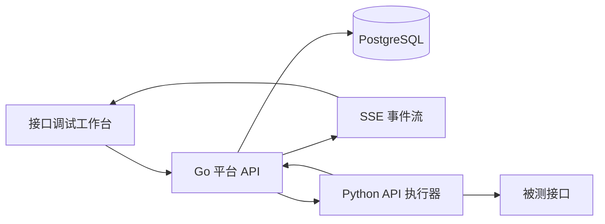

# Synapse QA 接口管理改造技术方案

| 项目 | 内容 |
| --- | --- |
| 文档版本 | V1.0 |
| 日期 | 2026-07-24 |
| 状态 | 已完成需求决策，待实施 |
| 关联文档 | `docs/PRD.md` |
| 适用对象 | 产品、前端、后端、执行器、测试与运维 |

## 1. 背景

当前接口管理复用 `ui_assets` 通用资源表，通过 `name/category/action/locator/value/description` 等字段承载接口信息，并把请求头、参数、Body、提取器、脚本和断言序列化到 `description` JSON。

该实现可以完成基础接口 CRUD 和浏览器单次请求，但存在以下结构性限制：

- 浏览器请求受 CORS 限制，不能稳定访问被测服务。
- 项目默认请求头仅在前端运行时合并，缺少统一服务端规则。
- 后置提取、脚本和断言只能保存，尚未进入实际调试链路。
- 缺少环境、认证、路径参数、版本、历史、脱敏和权限模型。
- 调试状态依赖轮询，缺少标准实时事件协议。
- 执行器 API Runner 只支持基础 HTTP 请求，取消、响应限制和受限脚本能力不足。
- 通用表无法提供 `产品 + 方法 + 标准化路径` 唯一约束。

本次改造目标是交付一个可可靠完成单接口调试的工作台，不包含接口测试用例编排和接口批量执行闭环。

## 2. 范围

### 2.1 本次范围

- 独立接口数据模型和旧数据迁移。
- 项目、产品、模块树和接口生命周期管理。
- 环境、变量、默认请求头、认证、参数和多种 Body 配置。
- cURL 导入与脱敏导出。
- 通过 API 执行器代理调试。
- SSE 实时进度、取消、超时和手动重试。
- JSONPath/正则提取、受限 Python 后置脚本和全量断言。
- 调试历史、接口版本、差异查看、回滚和软删除。
- 敏感数据识别、脱敏和角色操作校验。

### 2.2 不在本次范围

- 接口测试用例编排、数据驱动及批量执行。
- OpenAPI/Swagger 批量导入。
- OAuth 2.0 自动取 Token、签名认证和客户端证书认证。
- GraphQL 专用编辑器和任意二进制 Body。
- 自动重试、跨执行器故障转移和高级负载均衡。
- 将提取结果自动写回共享全局变量。
- 永久删除界面。

## 3. 关键设计原则

1. 接口定义与环境分离：接口保存路径，测试对象提供基础地址。
2. 调试与正式保存分离：允许使用未保存快照调试。
3. 平台负责编排、校验和归档；执行器负责网络请求和受限处理。
4. 所有执行步骤形成事件，页面实时展示且可断线补查。
5. 敏感数据仅在必要执行边界解密，普通响应、日志和历史不返回明文。
6. 配置保存、调试快照和历史记录均可追溯。
7. 旧数据迁移后一次切换，不进行长期双写。

## 4. 总体架构



职责划分：

| 组件 | 职责 |
| --- | --- |
| 前端 | 编辑配置、校验输入、提交快照、显示事件、结果与历史 |
| 平台 API | 权限、环境和变量解析、请求合并、任务调度、事件持久化、结果归档 |
| API 执行器 | 实际 HTTP 请求、响应限制、提取、受限脚本、断言、取消与进度上报 |
| PostgreSQL | 接口定义、版本、调试任务、断言明细、事件和临时文件元数据 |

## 5. 领域模型

### 5.1 接口定义 `api_interfaces`

```sql
create table api_interfaces (
    id bigserial primary key,
    product_id bigint not null references products(id),
    module_id bigint,
    name text not null,
    method text not null,
    path text not null,
    normalized_path text not null,
    protocol text not null default 'HTTP',
    endpoint_type text not null default 'WEB',
    lifecycle_status text not null default 'draft',
    timeout_seconds int not null default 30,
    follow_redirects boolean not null default true,
    auth_type text not null default 'none',
    auth_config jsonb not null default '{}'::jsonb,
    body_type text not null default 'none',
    body_config jsonb not null default '{}'::jsonb,
    post_script text not null default '',
    current_version int not null default 1,
    revision bigint not null default 1,
    last_debug_status text not null default '',
    last_debug_duration_ms bigint,
    last_debug_at timestamptz,
    created_by text not null,
    updated_by text not null,
    created_at timestamptz not null default now(),
    updated_at timestamptz not null default now(),
    deleted_at timestamptz,
    check(timeout_seconds between 1 and 300),
    check(current_version > 0),
    check(lifecycle_status in ('draft', 'active', 'disabled', 'deprecated')),
    foreign key(module_id, product_id) references product_modules(id, product_id)
);

create unique index uq_api_interfaces_active_path
    on api_interfaces(product_id, method, normalized_path)
    where deleted_at is null;
```

约束：

- `method` 枚举：`GET/POST/PUT/PATCH/DELETE/HEAD/OPTIONS`。
- `lifecycle_status` 枚举：`draft/active/disabled/deprecated`。
- `timeout_seconds` 范围：1～300 秒。
- `normalized_path` 移除查询串、合并重复斜杠、保证前导 `/`，路径参数统一保留为 `{name}`。
- 相对路径大小写保持原样，尾斜杠除根路径外移除，点段和百分号编码按 RFC 3986 规范化；占位符名称参与唯一性。
- 完整 URL 的 `normalized_path` 包含小写后的 scheme、host、显式端口和规范化 path，避免不同主机误判冲突。
- 更新要求客户端携带 `If-Match: <revision>`；不匹配返回 `409 API_INTERFACE_CHANGED`，避免并发覆盖。
- 正式保存接口主表、子项、版本快照和 revision 递增必须在同一数据库事务中完成。
- 恢复软删除接口时若命中活跃唯一索引，返回 `409 API_INTERFACE_RESTORE_CONFLICT`。

产品与模块一致性由复合外键保证，建表前先执行：

```sql
alter table product_modules
    add constraint uq_product_modules_id_product unique(id, product_id);
```

`module_id` 为空时 PostgreSQL 不校验复合外键，表示接口暂未归入模块。所有按 ID 查询仍必须校验资源项目作用域。

### 5.2 接口版本 `api_interface_versions`

```sql
create table api_interface_versions (
    id bigserial primary key,
    interface_id bigint not null references api_interfaces(id),
    version int not null,
    snapshot jsonb not null,
    change_summary text not null default '',
    created_by text not null,
    created_at timestamptz not null default now(),
    unique(interface_id, version)
);
```

正式保存创建版本；临时调试不创建版本。回滚通过读取历史快照并创建一个新版本完成，不覆盖既有历史。

### 5.3 请求项 `api_request_items`

统一存储请求头、路径参数、查询参数、form-data 和 urlencoded 字段。

```sql
create table api_request_items (
    id bigserial primary key,
    interface_id bigint not null references api_interfaces(id),
    item_type text not null,
    item_key text not null,
    item_key_normalized text not null,
    item_value text not null default '',
    value_type text not null default 'text',
    enabled boolean not null default true,
    sensitive boolean not null default false,
    sort_order int not null default 0,
    description text not null default '',
    created_at timestamptz not null default now(),
    updated_at timestamptz not null default now(),
    deleted_at timestamptz
);

create unique index uq_api_request_items_active_key
    on api_request_items(interface_id, item_type, item_key_normalized)
    where deleted_at is null;
```

`item_type`：`header/path/query/form_data/urlencoded`。  
`value_type`：`text/file`，仅 `form_data` 允许 `file`。

同一接口、类型和大小写归一后的 Key 不允许重复。路径参数必须与 URL 中 `{param}` 一致。Query 允许同名多值，因此 Query 使用同一个请求项的 JSON 数组值表达，不通过重复行表达。

### 5.4 提取规则 `api_extractors`

```sql
create table api_extractors (
    id bigserial primary key,
    interface_id bigint not null references api_interfaces(id),
    name text not null,
    extractor_type text not null,
    expression text not null,
    source text not null default 'body',
    default_value text not null default '',
    required boolean not null default true,
    enabled boolean not null default true,
    sensitive boolean not null default false,
    sort_order int not null default 0,
    created_at timestamptz not null default now(),
    updated_at timestamptz not null default now(),
    deleted_at timestamptz
);
```

`extractor_type`：`jsonpath/regex/header/status`。

### 5.5 断言规则 `api_assertions`

```sql
create table api_assertions (
    id bigserial primary key,
    interface_id bigint not null references api_interfaces(id),
    assertion_type text not null,
    source text not null,
    expression text not null default '',
    operator text not null,
    expected_value text not null default '',
    enabled boolean not null default true,
    sort_order int not null default 0,
    description text not null default '',
    created_at timestamptz not null default now(),
    updated_at timestamptz not null default now(),
    deleted_at timestamptz
);
```

首版断言类型：

- 状态码；
- 响应时间；
- 响应头；
- JSONPath；
- 正则；
- 响应体文本；
- 提取变量。

所有启用断言均执行，任意一条失败则调试结果失败。

### 5.6 调试记录 `api_debug_runs`

```sql
create table api_debug_runs (
    id bigserial primary key,
    task_id text not null unique,
    interface_id bigint references api_interfaces(id),
    interface_version int,
    executor_id text,
    test_object_id bigint references test_objects(id),
    status text not null default 'queued',
    config_source text not null default 'saved',
    snapshot_schema_version int not null default 1,
    snapshot_hash text not null,
    request_snapshot jsonb not null,
    response_status int,
    response_headers jsonb not null default '{}'::jsonb,
    response_body text not null default '',
    response_size bigint not null default 0,
    response_truncated boolean not null default false,
    redirect_chain jsonb not null default '[]'::jsonb,
    extracted_variables jsonb not null default '{}'::jsonb,
    script_output text not null default '',
    error_type text not null default '',
    error_message text not null default '',
    duration_ms bigint,
    parent_run_id bigint references api_debug_runs(id),
    cancel_requested_at timestamptz,
    state_version bigint not null default 1,
    triggered_by text not null,
    started_at timestamptz,
    finished_at timestamptz,
    created_at timestamptz not null default now()
);
```

状态：`queued/dispatched/running/success/failed/canceled/timeout`。  
`config_source`：`saved/temporary`。

`executor_id` 在 queued 阶段允许为空，分配成功后以状态 CAS 同时写入执行器和 `dispatched`。`request_snapshot` 是用户提交且完成结构校验后的不可变配置快照；解析后的最终请求另存脱敏副本，原始敏感值仅以字段级密文保存。`snapshot_hash` 用于重跑和审计比对。

默认接口详情加载最近 20 次记录。响应正文最多保存前 1 MB，记录原始大小和截断标记。

### 5.7 调试断言明细 `api_debug_assertions`

```sql
create table api_debug_assertions (
    id bigserial primary key,
    debug_run_id bigint not null references api_debug_runs(id),
    assertion_id bigint,
    assertion_snapshot jsonb not null,
    status text not null,
    expected_value text not null default '',
    actual_value text not null default '',
    message text not null default '',
    duration_ms bigint not null default 0,
    created_at timestamptz not null default now()
);
```

### 5.8 临时文件 `api_temp_files`

```sql
create table api_temp_files (
    id uuid primary key,
    owner text not null,
    original_name text not null,
    storage_path text not null,
    mime_type text not null,
    size_bytes bigint not null,
    sha256 text not null,
    expires_at timestamptz not null,
    created_at timestamptz not null default now()
);
```

- 单文件上限 20 MB。
- 单次请求附件总量上限 50 MB。
- 最长保留 24 小时。
- 调试历史只保留文件名、大小、MIME 和哈希。
- 上传时校验扩展名、实际 MIME 和禁止类型。

### 5.9 调试事件 `api_debug_events`

```sql
create table api_debug_events (
    id bigserial primary key,
    debug_run_id bigint not null references api_debug_runs(id),
    sequence bigint not null,
    event_type text not null,
    stage text not null default '',
    status text not null,
    message text not null default '',
    progress int not null default 0,
    event_data jsonb not null default '{}'::jsonb,
    created_at timestamptz not null default now(),
    unique(debug_run_id, sequence)
);
```

事件完成后至少保留 24 小时，清理任务不得早于调试历史结果归档。

### 5.10 项目默认请求头

当前 `api_request_header` 通用资源应迁移为独立表：

```sql
create table api_project_headers (
    id bigserial primary key,
    project_id bigint not null references projects(id),
    header_name text not null,
    header_name_normalized text not null,
    header_value text not null default '',
    description text not null default '',
    enabled boolean not null default true,
    sensitive boolean not null default false,
    created_by text not null,
    updated_by text not null,
    created_at timestamptz not null default now(),
    updated_at timestamptz not null default now(),
    deleted_at timestamptz,
    check(header_name_normalized <> '')
);

create unique index uq_api_project_headers_active_name
    on api_project_headers(project_id, header_name_normalized)
    where deleted_at is null;
```

### 5.11 权限

当前角色模型没有细粒度权限关系，本次新增：

```sql
create table permissions (
    id bigserial primary key,
    code text not null unique,
    name text not null,
    description text not null default '',
    created_at timestamptz not null default now()
);

create table role_permissions (
    role_id bigint not null references roles(id),
    permission_id bigint not null references permissions(id),
    created_at timestamptz not null default now(),
    primary key(role_id, permission_id)
);

create table project_members (
    user_id bigint not null references users(id),
    project_id bigint not null references projects(id),
    role_id bigint not null references roles(id),
    created_at timestamptz not null default now(),
    primary key(user_id, project_id)
);
```

权限种子数据随数据库迁移写入；内置角色采用可重复执行的 upsert 建立默认映射。同一用户在同一项目只有一个项目角色，这是本期有意限制；权限集合通过 `project_members.role_id → role_permissions` 查询。

### 5.12 临时调试会话 `api_debug_sessions`

```sql
create table api_debug_sessions (
    id uuid primary key,
    user_id bigint not null references users(id),
    project_id bigint not null references projects(id),
    executor_id text not null,
    status text not null default 'active',
    last_active_at timestamptz not null default now(),
    expires_at timestamptz not null,
    created_at timestamptz not null default now()
);
```

会话创建时绑定执行器，后续同一会话任务固定路由到该执行器，保证 Cookie Jar 连续性。执行器离线时会话失效，不自动把 Cookie 迁移到其他执行器。

### 5.13 安全审计 `security_audit_events`

现有 `operation_logs` 继续记录普通业务操作；敏感值访问使用只追加的独立审计表：

```sql
create table security_audit_events (
    id bigserial primary key,
    actor_user_id bigint not null references users(id),
    project_id bigint references projects(id),
    action text not null,
    resource_type text not null,
    resource_id text not null,
    reason text not null default '',
    request_id text not null,
    client_ip text not null default '',
    result text not null,
    created_at timestamptz not null default now()
);
```

敏感值采用统一加密 Envelope：

```json
{
  "encrypted": true,
  "alg": "AES-256-GCM",
  "keyId": "api-secret-v1",
  "nonce": "...",
  "ciphertext": "..."
}
```

密钥由环境或外部密钥服务提供，不写入数据库。轮换时保留旧 keyId 的只读解密能力，并通过后台任务重加密。

界面自动化现有全局变量在阶段二通过变量读取适配器复用，其当前存储仍在 `ui_assets/global_variable`；本次不迁移该资源，但适配器必须按产品、环境和状态返回类型化变量，并在进入调试快照前完成权限与敏感标记处理。

## 6. 配置与执行规则

### 6.1 URL 构建

1. 如果接口 `path` 是完整 URL，直接作为基础目标。
2. 否则必须选择测试对象，将 `test_objects.target + path` 拼接。
3. 解析并替换路径参数。
4. 附加启用的查询参数。
5. 输出编码后的最终 URL。

缺少环境、路径参数或变量时，在平台端拒绝下发执行器。

### 6.2 变量优先级

```text
本次调试临时变量 > 环境级全局变量 > 项目级全局变量
```

变量用于 URL、认证、请求头、参数、Body、提取器、脚本输入和断言预期值。`${name}` 未解析时禁止执行。

提取变量默认只在当前调试和临时会话中存在。保存为共享变量必须由用户显式操作并经过权限校验。

### 6.3 请求头合并

```text
本次调试临时请求头 > 接口自定义请求头 > 项目默认请求头
```

- Key 比较忽略大小写。
- 高优先级空值删除低优先级继承项。
- `Host`、`Content-Length`、`Transfer-Encoding`、`Connection` 等受限 Header 不允许手工配置。
- 确定性处理顺序为：过滤受限 Header → 项目默认 → 接口配置 → 临时配置/空值删除 → Body 自动 Content-Type → 认证 → Cookie 会话。
- 认证和 Cookie 生成项不可被空值删除；手工冲突时保留生成值并返回 warning。
- Query 使用有序 multimap；普通参数允许多值，API Key Query 与同名普通参数冲突时认证值覆盖并返回 warning。

### 6.3.1 变量解析算法

- 变量名大小写敏感。
- 支持字符串、数字、布尔和 JSON，嵌入字符串时统一转为文本。
- `${name}` 为引用；`\${name}` 表示字面量。
- 支持变量递归引用，最大深度 10。
- 检测循环并返回 `API_VARIABLE_CYCLE`。
- 空字符串是有效值，变量不存在才算缺失。
- 提取变量写入会话变量层，仅影响后续调试，不覆盖临时输入变量。

### 6.4 认证

首版支持：

| 类型 | 配置 |
| --- | --- |
| none | 无 |
| bearer | Token |
| basic | 用户名、密码 |
| api_key | 名称、值、位置（Header/Query） |

认证值可引用变量，敏感值以加密字段保存并在普通接口响应中脱敏。

### 6.5 Body

| 类型 | 编辑方式 | Content-Type |
| --- | --- | --- |
| none | 无 | 不自动设置 |
| json | Monaco/代码编辑器 | `application/json` |
| form_data | 键值表格与文件 | 自动生成 multipart boundary |
| urlencoded | 键值表格 | `application/x-www-form-urlencoded` |
| raw | 文本编辑器 | 用户指定 |

### 6.6 响应处理

固定顺序：

```text
响应接收 → 提取 → 受限脚本 → 全量断言 → 结果归档
```

- 最大接收 20 MB，超过即停止读取并标记 `response_too_large`。
- 页面和历史最多展示/保存前 1 MB。
- JSON 格式化仅对未截断且解析成功的响应开放。
- 默认跟随重定向，最多 5 次，保留跳转链。
- 默认严格校验 TLS；仅非生产测试对象允许本次调试临时关闭。

为避免通过环境名称猜测生产属性，`test_objects` 增加 `is_production boolean not null default false`。关闭 TLS 校验要求 `is_production=false` 且用户拥有 `api.debug.insecure_tls` 权限。

网络代理只由执行器部署环境配置，例如 `HTTP_PROXY/HTTPS_PROXY/NO_PROXY`，不允许接口或用户在调试请求中传入代理地址。执行器在注册和心跳中仅上报是否已配置代理，不上报代理凭据。

### 6.7 后置脚本

脚本上下文只提供：

```python
response
request
variables
logger
```

限制：

- 最长 5 秒。
- 禁止文件、网络、进程和任意模块导入。
- 只能修改本次调试变量。
- 异常或超时使调试失败。

实现上不得直接在执行器主进程调用不受限 `exec`。建议启动独立受限子进程，使用 AST 白名单、最小环境变量、资源限制和超时终止；Windows 下需额外使用 Job Object 或等价进程树终止机制。

AST 白名单本身不视为安全沙箱。正式启用必须同时具备低权限独立账户、文件系统隔离、默认断网、CPU/内存限制和进程树终止；若阶段四无法通过逃逸测试，则后置脚本保持功能开关关闭，不影响提取和结构化断言交付。

### 6.8 Cookie 会话

- 默认无状态。
- 显式开启调试会话后，由平台生成 `sessionId`。
- 执行器按 `sessionId + user + project` 隔离 Cookie Jar。
- 会话在平台侧绑定一个执行器，避免多执行器调度导致 Cookie 丢失。
- 30 分钟无操作或用户主动关闭后销毁。
- Cookie 不进入接口正式配置，历史仅保存脱敏摘要。

### 6.9 重试

任何方法默认均不自动重试。失败后只提供用户手动重新执行，并生成新的调试记录。

## 7. API 设计

统一前缀：`/api/api-automation`。

本文档定义资源和业务语义；实施时必须同步维护 `docs/openapi/api-automation.yaml` 作为前后端可执行契约。所有 DTO 必须包含字段必填性、nullable 语义、枚举、长度、批量部分失败结构、分页排序白名单、错误码和示例。前端类型和后端契约测试从该文件生成，未进入 OpenAPI 的字段不得直接上线。

### 7.1 接口定义

```text
GET    /interfaces
POST   /interfaces
GET    /interfaces/:id
PATCH  /interfaces/:id
DELETE /interfaces/:id
POST   /interfaces/:id/restore
POST   /interfaces/:id/deprecate
POST   /interfaces/batch-status
POST   /interfaces/batch-move
POST   /interfaces/batch-delete
GET    /interfaces/export
```

列表筛选：

- `projectId`
- `productId`
- `moduleId`
- `keyword`
- `method`
- `lifecycleStatus`
- `lastDebugStatus`
- `updatedBy`
- `page`
- `pageSize`
- `sort`

### 7.2 版本

```text
GET  /interfaces/:id/versions
GET  /interfaces/:id/versions/:version
GET  /interfaces/:id/versions/:version/diff?targetVersion=n
POST /interfaces/:id/versions/:version/restore
```

### 7.3 项目默认请求头

```text
GET    /project-headers?projectId=:id
POST   /project-headers
PATCH  /project-headers/:id
DELETE /project-headers/:id
```

### 7.4 cURL

```text
POST /curl/parse
POST /interfaces/:id/curl
```

解析接口只返回配置预览，不自动保存。导出默认脱敏，可由具备敏感值权限的用户显式选择在当前会话复制原值。

### 7.5 文件

```text
POST   /temp-files
DELETE /temp-files/:id
```

### 7.6 调试

```text
POST /interfaces/:id/debug
GET  /debug/:taskId
GET  /debug/:taskId/events
POST /debug/:taskId/cancel
POST /debug/:taskId/rerun
GET  /interfaces/:id/debug-runs
GET  /debug-runs/:id
POST /debug-sessions
POST /debug-sessions/:id/close
```

`POST /interfaces/:id/debug` 可以传当前编辑区 `snapshot`。存在 snapshot 时 `configSource=temporary`，不存在时使用已保存版本。

首版不提供脱离接口归属的 standalone debug，确保项目权限、默认请求头、变量和历史归属明确。

示例：

```json
{
  "testObjectId": 12,
  "snapshot": {
    "method": "POST",
    "path": "/users/{userId}",
    "headers": [],
    "pathParams": [],
    "queryParams": [],
    "auth": {},
    "body": {},
    "extractors": [],
    "postScript": "",
    "assertions": []
  },
  "temporaryVariables": {
    "userId": "1001"
  },
  "temporaryHeaders": [],
  "sessionId": null,
  "protocolVersion": "2.0",
  "idempotencyKey": "client-generated-uuid",
  "verifyTls": true
}
```

`rerun` 必须显式选择：

- `exact`：使用原不可变快照和原环境 ID重新解析当前密钥；临时文件过期则失败。
- `current`：使用接口当前版本和当前环境变量。

新记录通过 `parentRunId` 关联原记录，不覆盖原结果。

返回：

```json
{
  "data": {
    "taskId": "api-debug-...",
    "status": "queued",
    "executorId": "executor-api-01",
    "eventUrl": "/api/api-automation/debug/api-debug-.../events"
  }
}
```

## 8. SSE 事件协议

响应类型：`text/event-stream`。

标准 SSE 帧：

```text
id: 8
event: assertion.completed
data: {"sequence":8,"taskId":"api-debug-...","stage":"assertion","status":"running","message":"状态码断言通过","progress":86,"data":{},"timestamp":"2026-07-24T10:30:00+08:00"}

```

事件 data 统一结构：

```json
{
  "sequence": 8,
  "taskId": "api-debug-...",
  "type": "assertion.completed",
  "stage": "assertion",
  "status": "running",
  "message": "状态码断言通过",
  "progress": 86,
  "data": {},
  "timestamp": "2026-07-24T10:30:00+08:00"
}
```

事件类型：

| 事件 | 含义 |
| --- | --- |
| `task.queued` | 已创建任务 |
| `executor.assigned` | 已分配执行器 |
| `request.built` | 请求构建与变量解析完成 |
| `request.connecting` | 正在建立连接 |
| `response.headers` | 已收到响应头 |
| `response.reading` | 正在读取响应体 |
| `extractor.completed` | 单条提取完成 |
| `script.started/completed` | 后置脚本阶段 |
| `assertion.completed` | 单条断言完成 |
| `task.completed` | 调试成功 |
| `task.failed` | 调试失败 |
| `task.canceled` | 已取消 |
| `task.timeout` | 已超时 |

要求：

- `sequence` 在单任务内严格递增。
- 平台接收执行器原始 `eventId` 并去重，由平台单任务串行写入器在事务中分配最终 sequence。
- SSE `id` 等于 sequence；前端携带 `Last-Event-ID` 重连。
- 事件至少保存至调试记录完成后 24 小时。
- SSE 断开不影响任务执行。
- 每 15 秒发送 `event: heartbeat`，避免代理关闭空闲连接。
- 响应设置 `Cache-Control: no-cache` 和 `X-Accel-Buffering: no`。
- EventSource 使用用户登录 Cookie，或由平台签发 60 秒有效、绑定用户和 taskId 的一次性流 Token；不得把长期 Bearer Token 放在 URL。
- 事件已过保留期时返回 `410 API_DEBUG_EVENTS_EXPIRED`，前端改用结果补查。
- `GET /debug/:taskId` 返回当前状态、stateVersion、latestSequence、脱敏结果和终态信息；不与事件流复用响应。

### 8.1 调试状态机

| 当前状态 | 允许进入 | 说明 |
| --- | --- | --- |
| queued | dispatched、canceled、timeout、failed | 等待执行器 |
| dispatched | running、canceled、timeout、failed | 已接受下发 |
| running | success、failed、canceled、timeout | 正在执行 |
| success/failed/canceled/timeout | 无 | 终态不可逆 |

- 所有状态更新使用 `state_version` CAS。
- 取消请求幂等：终态返回 200 和当前结果；queued 直接 canceled；dispatched/running 返回 202 并记录 `cancel_requested_at`。
- 取消后迟到的 success/failed 回调只记录审计，不覆盖 canceled。
- 平台重启后扫描非终态记录；超过 deadline 的记录置 timeout，其余重新查询已分配执行器。
- 下发失败且尚未被执行器确认时可以回到 queued；一旦执行器确认则不自动换执行器。

### 8.2 超时

| 类型 | 默认值 | 起点 |
| --- | --- | --- |
| 排队超时 | 60 秒 | 创建调试记录 |
| 连接超时 | 10 秒 | 执行器开始连接 |
| 读取空闲超时 | 30 秒 | 两次响应数据之间 |
| 总请求超时 | 接口配置，默认 30 秒 | 发起网络请求 |
| 脚本超时 | 5 秒 | 脚本子进程启动 |

总任务 deadline 覆盖请求、提取、脚本和断言，由平台在任务下发时计算。响应读取超过 20 MB 统一终止为 `failed/API_RESPONSE_TOO_LARGE`；`response_size` 表示已读取字节数，并标记为下界而非真实完整大小。

## 9. 执行器协议改造

### 9.1 API Runner 入参

```json
{
  "taskId": "api-debug-...",
  "type": "api",
  "protocolVersion": "2.0",
  "idempotencyKey": "uuid",
  "attempt": 1,
  "payload": {
    "request": {
      "method": "POST",
      "url": "https://test.example.com/users/1001",
      "headers": {},
      "query": [],
      "bodyType": "json",
      "body": "{}",
      "timeoutSeconds": 30,
      "followRedirects": true,
      "maxRedirects": 5,
      "verifyTls": true,
      "maxResponseBytes": 20971520
    },
    "files": [
      {
        "id": "uuid",
        "name": "demo.txt",
        "mime": "text/plain",
        "size": 128,
        "sha256": "...",
        "downloadUrl": "https://platform/internal/files/one-time-token",
        "expiresAt": "2026-07-24T10:35:00+08:00"
      }
    ],
    "extractors": [],
    "postScript": "",
    "assertions": [],
    "session": {
      "id": "uuid",
      "scopeToken": "signed-user-project-executor-claim"
    }
  },
  "eventCallbackUrl": ".../events",
  "resultCallbackUrl": ".../result",
  "taskSecret": "base64-random-secret"
}
```

执行器不得接收未解析的平台密钥引用。平台下发前完成权限校验和必要解密，执行器仅在内存中使用。

临时文件不依赖平台与执行器共享磁盘。平台为单次任务签发短时、一次性下载地址，执行器下载后校验文件大小和 SHA-256；任务结束立即删除执行器本地副本。

平台与执行器协议：

| 操作 | 方法与路径 | 语义 |
| --- | --- | --- |
| 创建任务 | `POST /tasks` | 以 idempotencyKey 幂等接收，返回 202 和任务状态 |
| 查询任务 | `GET /tasks/:taskId` | 返回协议版本、状态、latestEventId 和结果摘要 |
| 取消任务 | `POST /tasks/:taskId/cancel` | 幂等取消，返回当前状态 |
| 事件回调 | `POST eventCallbackUrl` | 可重复投递，平台按 taskId+eventId 去重 |
| 结果回调 | `POST resultCallbackUrl` | 终态结果，按 taskId+attempt 幂等 |

平台不对执行器网络错误自动重试非幂等 HTTP 请求；这里只允许重试“创建任务”控制请求，因为执行器按 idempotencyKey 去重。平台和执行器注册时协商 `protocolVersion=2.0`，不支持该版本或 `api_debug_v2` 能力的执行器不得被选中。

### 9.2 取消

当前 `TaskManager.cancel` 只能可靠取消排队任务，需要改造为：

- 每个任务持有取消令牌。
- API Runner 使用可中断客户端和分块读取。
- 取消时关闭当前响应流。
- 脚本子进程取消时终止整个进程树。
- 完成回调前再次检查取消状态，避免取消后被覆盖为成功。

### 9.3 执行器鉴权

平台调用执行器 `/tasks`、查询和取消接口时增加内部鉴权 Header，例如：

```text
X-Executor-Token: <executor-specific-token>
```

执行器回调平台时增加任务级 HMAC：

```text
X-Task-Signature: HMAC-SHA256(taskSecret, rawBody)
```

回调额外携带：

```text
X-Task-Timestamp: unix-seconds
X-Task-Nonce: random
X-Task-Signature: HMAC-SHA256(taskSecret, timestamp + "\n" + nonce + "\n" + taskId + "\n" + sha256(rawBody))
```

`taskSecret` 随任务下发，仅内存保存。平台允许时间偏差 60 秒，并以 `taskId + nonce` 保存短期去重记录，防止重放。平台与执行器通信必须使用 TLS；内部 Token 加密存储并支持轮换。

执行器注册与心跳新增能力：

```json
{
  "protocolVersions": ["1.0", "2.0"],
  "capabilities": ["api_debug_v2", "cancel_running", "script_sandbox_v1"],
  "proxyConfigured": false
}
```

选择条件为在线、支持协议 2.0、声明 `api_debug_v2` 且队列有容量；启用脚本的任务还要求 `script_sandbox_v1`。

## 10. 权限与安全

### 10.1 权限代码

建议新增：

```text
api.interface.read
api.interface.write
api.interface.debug
api.interface.delete
api.interface.restore
api.interface.version.restore
api.secret.read
api.secret.write
api.script.execute
api.project_header.manage
api.debug.insecure_tls
api.debug.session
api.file.upload
api.batch.manage
api.secret.reveal
api.secret.export
```

默认映射：

| 角色 | 权限 |
| --- | --- |
| 管理员 | 全部 |
| 测试负责人 | 读、写、调试、停用、版本、脱敏历史 |
| 自动化工程师 | 读、写、调试、脱敏历史 |
| 只读访客 | 读、脱敏历史 |

后端权限校验是安全边界，前端隐藏按钮仅用于交互提示。

权限采用“全局角色权限 + 项目资源作用域”。所有接口、调试、文件、SSE、版本和请求头接口必须先通过 ID 反查项目，再校验当前用户是否拥有该项目访问范围，禁止只按资源 ID 操作。管理员默认拥有所有项目；其他角色的项目成员关系在 `project_members(user_id, project_id, role_id)` 中维护。

### 10.2 敏感字段

自动识别名称：

```text
authorization
cookie
set-cookie
x-api-key
*token*
*secret*
*password*
*key*
```

用户可手工标记敏感。敏感值要求：

- 数据库存储前使用应用级密钥加密，不使用不可逆哈希，因为执行时需要原值。
- 列表、版本差异、调试历史、日志和普通导出统一脱敏。
- 解密和复制原值记录操作审计。
- 执行器不在 output、error 和事件 data 中返回明文。

任务创建时构建 secret registry。所有日志、事件、错误、请求预览和历史落库前执行结构化 Header/Cookie 脱敏及已知敏感值替换。最终请求面板默认只展示掩码；原值只能通过 `api.secret.reveal` 专用接口短时查看，要求二次确认、填写原因、`Cache-Control: no-store` 并写安全审计。cURL 原值导出使用一次性 Token，并同样审计。

任意响应正文可能包含平台未知敏感值，无法保证通过名称规则完全脱敏。被标记为“敏感响应”的接口默认不持久化响应正文，只保存加密附件引用和受控查看审计。

### 10.3 SSRF 防护

执行器代理请求必须实施：

- 只允许 `http` 和 `https`。
- 项目可配置域名/网段 allowlist，完整 URL 覆盖要求专门权限。
- 默认阻断 loopback、link-local、multicast、保留地址、云元数据地址和未授权私网。
- DNS 解析后校验全部 IP，连接时绑定已校验结果，防止 DNS rebinding。
- 每次重定向重新执行协议、域名和 IP 校验。
- 端口默认仅允许 80/443，其他端口需项目级显式授权。
- 记录目标域名、解析 IP、端口、重定向链和拒绝原因。

## 11. 前端设计

### 11.1 接口列表

布局：

- 左侧可折叠项目 → 产品 → 模块树。
- 右侧为紧凑筛选区、列表工具栏、表格和底部分页。
- 树节点状态与展开状态保存在本地。
- 顶部搜索支持跨项目。

默认列：

- 接口名称；
- 方法与路径；
- 项目/产品；
- 模块；
- 生命周期状态；
- 最近调试状态与耗时；
- 最近修改人和时间。

行内操作只保留“调试、详情”，编辑、复制、废弃、删除进入更多菜单。

批量操作：

- 移动模块；
- 启用、停用、废弃；
- 导出；
- 软删除。

移除“批量执行”入口。

### 11.2 接口详情

三栏工作台：

| 区域 | 内容 |
| --- | --- |
| 左栏 | 基础信息、认证、请求头、路径参数、查询参数、Body、提取、脚本、断言、版本 |
| 中栏 | 当前配置编辑器 |
| 右栏 | 最终请求、事件日志、响应、断言、变量和历史 |

- 中右栏可拖动调整。
- 右栏可折叠。
- 小屏幕时右栏转为底部抽屉。
- 编辑区未保存时显示脏状态。
- “调试”使用当前快照；“保存”才生成正式版本。

### 11.3 编辑器

- Headers/参数：键值表格，支持启停、排序和批量粘贴。
- JSON：格式化、语法校验和变量高亮。
- form-data：文本/文件切换。
- raw：纯文本与 Content-Type。
- URL 输入时自动识别 `{param}` 并同步路径参数。
- 最终请求面板只读展示解析后的 URL、Header 和 Body。

## 12. 数据迁移

迁移基础表：

```sql
create table api_migration_runs (
    id uuid primary key,
    migration_key text not null unique,
    status text not null,
    source_count bigint not null default 0,
    migrated_count bigint not null default 0,
    conflict_count bigint not null default 0,
    error_count bigint not null default 0,
    started_at timestamptz not null default now(),
    finished_at timestamptz
);

create table api_migration_id_map (
    run_id uuid not null references api_migration_runs(id),
    source_type text not null,
    source_id bigint not null,
    target_type text not null,
    target_id bigint,
    status text not null,
    primary key(run_id, source_type, source_id)
);

create table api_migration_issues (
    id bigserial primary key,
    run_id uuid not null references api_migration_runs(id),
    source_type text not null,
    source_id bigint not null,
    issue_type text not null,
    message text not null,
    raw_payload jsonb not null,
    resolution_status text not null default 'pending',
    resolution text not null default '',
    target_id bigint,
    created_at timestamptz not null default now()
);
```

冲突最终处理方式仅允许：合并到已有 target、放弃迁入、修正数据后迁入。处理后写入 `resolution_status=resolved`、`resolution` 和可选 `target_id`。

`migration_key` 固定到迁移版本，重复执行只续跑未成功映射项。每批 200 条、每批独立事务；批次失败回滚当前批，不回滚已校验批次。切换前必须满足：

- 源记录数 = 正式迁入数 + 已决冲突数 + 错误数；
- 成功映射记录的关键字段哈希一致；
- 不存在 pending 冲突；
- 抽样接口的版本快照可反序列化。

### 12.1 来源

- 接口：`ui_assets.asset_type='api_interface'`
- 项目默认请求头：`ui_assets.asset_type='api_request_header'`

### 12.2 转换

接口字段映射：

| 旧字段 | 新字段 |
| --- | --- |
| `name` | `api_interfaces.name` |
| `category` | `product_id` |
| `action` | 通过产品和模块名称解析 `module_id` |
| `locator` | `path` |
| `method` | `method` |
| `value` | `protocol` |
| `status` | `active/disabled`，其他转 `draft` |
| `description.endpointType` | `endpoint_type` |
| `description.headers` | `api_request_items/header` |
| `description.params` | `api_request_items/query` |
| `description.body` | `body_config` |
| `description.jsonpath` | `api_extractors/jsonpath` |
| `description.regex` | `api_extractors/regex` |
| `description.script` | 版本快照中的 `postScript` |
| `description.assertions` | `api_assertions` |

项目默认请求头字段映射：

| 旧字段 | 新字段/规则 |
| --- | --- |
| `category` | 解析为项目 ID；优先直接解析数字 ID，否则按项目名称精确匹配 |
| `name` | `header_name`，同时生成小写 `header_name_normalized` |
| `value` | `header_value` |
| `description` | `description` |
| `status` | `active` 转 `enabled=true`，其他转 false |
| `created_by` | `created_by/updated_by`，为空时使用 `migration` |
| Header 名称命中敏感规则 | `sensitive=true`，值迁移时加密 |

同一项目存在大小写不同的重复 Header 时，更新时间最新的一条进入正式表，其余进入迁移问题表；无法解析项目、Header 名为空或值无法加密均记为 error，不创建正式记录。

无法解析的字段写入 `api_migration_issues`，不静默丢弃。

### 12.3 切换步骤

1. 创建新表和索引。
2. 以事务批量迁移旧数据。
3. 输出记录数、字段完整率、无法解析项和唯一冲突报告。
4. 对每条旧接口生成 V1 版本快照。
5. 后端启用新仓储读取校验接口。
6. 自动化测试与人工抽样通过后切换写入。
7. 旧接口设置为只读，保留回滚开关。
8. 稳定一个版本后再评估清理，不在本次删除旧数据。

若相同产品存在重复 `method + normalized_path`，迁移不自动覆盖；更新时间最新的一条进入正式表，其余原始载荷进入 `api_migration_issues`，状态为 `pending`，不受正式表唯一索引阻塞。迁移后的接口列表数量只与最终决定正式迁入的记录数一致，不要求与源表总数相等。

## 13. 错误模型

统一错误结构：

```json
{
  "error": {
    "code": "API_VARIABLE_MISSING",
    "message": "缺少变量 userId",
    "field": "pathParams.userId",
    "details": {}
  }
}
```

主要错误码：

```text
API_EXECUTOR_UNAVAILABLE
API_VARIABLE_MISSING
API_PATH_PARAM_MISSING
API_HEADER_RESTRICTED
API_AUTH_CONFLICT
API_REQUEST_TIMEOUT
API_CONNECT_TIMEOUT
API_READ_TIMEOUT
API_RESPONSE_TOO_LARGE
API_SCRIPT_TIMEOUT
API_SCRIPT_FORBIDDEN
API_ASSERTION_FAILED
API_CANCELED
API_TEMP_FILE_INVALID
API_PERMISSION_DENIED
```

## 14. 测试策略

### 14.1 后端

- 接口唯一性、生命周期和软删除。
- 正式保存生成版本，临时调试不生成版本。
- URL、变量和请求头优先级。
- 空 Header 删除继承值。
- 权限和敏感值脱敏。
- 迁移成功、无法解析、重复冲突和回滚。
- SSE sequence、断线重连和最终补查。
- 回调签名校验与重放防护。

### 14.2 执行器

- 五种 Body 类型。
- 重定向、TLS、Cookie 会话和代理。
- 连接、读取和总超时。
- 20 MB 响应限制与 1 MB 展示截断。
- JSONPath、正则、脚本和全量断言顺序。
- 排队与运行中取消。
- 脚本禁止导入、文件、网络和进程。
- 敏感值不进入日志、事件和错误。

### 14.3 前端

- 树筛选、跨项目搜索、列配置和底部分页。
- 路径参数自动识别。
- 请求头合并预览。
- cURL 解析和脱敏导出。
- 临时快照调试和脏状态。
- SSE 事件顺序、重连和结果补查。
- 取消、超时、截断和断言失败展示。
- 权限按钮与脱敏显示。

### 14.4 端到端验收

1. 创建项目、产品、环境和项目默认请求头。
2. 导入 cURL 创建接口并保存 V1。
3. 修改未保存配置后使用测试环境调试。
4. 验证变量、认证、请求头和路径参数正确合并。
5. 验证执行器实时返回请求、响应、提取、脚本和断言步骤。
6. 验证多条断言全部执行并汇总。
7. 验证历史标记为临时配置，正式接口仍保持 V1。
8. 保存后生成 V2，查看差异并回滚生成 V3。
9. 验证敏感值在列表、日志、历史和 cURL 中脱敏。
10. 验证取消、超时、响应过大和执行器离线场景。

## 15. 分阶段实施

### 阶段一：数据与列表

- 新表、索引、模型、仓储、服务和 Controller。
- 旧接口及项目请求头迁移。
- 基础权限代码、项目成员作用域和后端资源校验。
- 项目默认请求头敏感值加密、普通 DTO 脱敏和安全审计。
- 项目/产品/模块树。
- 新接口列表、生命周期、批量管理和软删除。
- 版本 V1 初始化和回滚开关。

验收：迁移核对公式成立且无 pending 问题；所有决定正式迁入的旧接口均可在新列表查询且核心字段一致；越权 ID 请求返回 403；敏感值不出现在普通 DTO；新 CRUD 不再写入 `ui_assets`。任一门槛失败则保持 V2 开关关闭。

### 阶段二：请求编辑

- 三栏详情框架。
- 环境与变量解析。
- Header、路径、Query、认证和五种 Body。
- 最终请求预览。
- cURL 导入和脱敏导出。
- 临时文件服务。
- 认证密钥字段级加密、文件授权和定时清理。

验收：不调用被测服务也能构建并预览完整请求，所有缺失项在平台端准确定位；数据库和日志中无认证明文；过期或跨项目文件引用均被拒绝。

### 阶段三：执行器调试

- API Runner 升级。
- 最小 `api_debug_runs` 与 `api_debug_events` 持久化。
- 平台调试任务与专属执行器选择。
- SSE 事件。
- 超时、响应限制、重定向、TLS、Cookie 会话和可靠取消。
- 任务级回调签名。

验收：目标接口通过执行器执行，浏览器不直接访问被测服务；request/response/terminal 事件实时返回且断线可恢复；取消、超时、SSRF 拒绝和 20 MB 限制契约测试通过。阶段三不要求提取、脚本和断言事件。

### 阶段四：处理、治理与历史

- 提取器。
- 受限 Python 脚本。
- 全量断言。
- 完整历史查询 UI和断言明细。
- 版本差异与回滚。
- 高权限 reveal/export、脚本权限与追加审计。
- 文件与事件清理任务。

验收：完整链路、提取/脚本/断言 processing 事件、权限、安全、历史和版本用例全部通过；脚本沙箱逃逸测试失败时保持脚本开关关闭，其余能力可验收，但不能宣布脚本能力交付。

## 16. 上线与回滚

上线前：

- 完成数据库备份。
- 运行迁移预检并处理唯一冲突。
- 至少准备一台支持新版 `api` 协议的执行器。
- 验证应用加密密钥和任务签名密钥。
- 确认临时文件目录容量和清理任务。

灰度：

- 使用配置开关 `API_AUTOMATION_V2_ENABLED`。
- 管理员和自动化工程师先灰度。
- 新旧读取结果对比，但只允许一个写入源。

回滚：

- 关闭 V2 开关。
- 恢复旧接口只读/写策略。
- 新表保留，不执行反向覆盖。
- 已生成调试记录继续保留供排障。

## 17. 完成定义

同时满足以下条件才算完成：

- 新接口数据模型稳定运行，旧数据迁移无静默丢失。
- 浏览器不再直接调用被测接口。
- 请求构建、执行、提取、脚本、断言和归档全部经过执行器。
- SSE 实时事件、取消、超时和断线恢复可用。
- 敏感值不出现在普通接口响应、日志或历史中。
- 接口版本、临时调试快照和软删除可追溯。
- 四阶段自动化测试和端到端验收全部通过。
- 接口用例和批量执行仍保持未开放状态，不产生误导入口。
